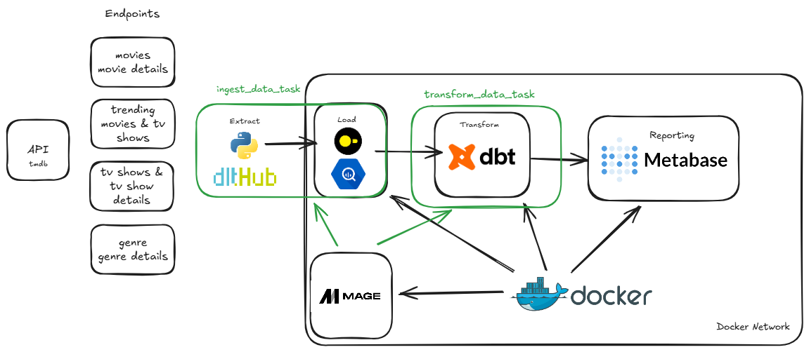

This project implements an end-to-end ELT (Extract, Load, Transform) pipeline that ingests, processes, and transforms data from **The Movie Database (TMDB) API** into Google BigQuery. It leverages modern data engineering tools including **Mage**, **dlt**, and **dbt**.

## Architecture



The workflow is orchestrated by **Mage** and consists of two main stages:
1. **Ingestion (EL):** `dlt` (Data Load Tool) extracts data from the TMDB API and loads it into BigQuery.
2. **Transformation (T):** `dbt` (data build tool) transforms the raw data within BigQuery into analytical models.

All components are containerized using **Docker** for consistent execution environments.

### Technology Stack
- **Orchestration:** Mage
- **Ingestion:** dlt (Data Load Tool)
- **Transformation:** dbt (Data Build Tool)
- **Data Warehouse:** Google BigQuery
- **Infrastructure:** Docker & Docker Compose
- **Language:** Python 3.10+
- **Dependency Management:** uv

## Prerequisites

Before running this project, ensure you have the following installed:
- [Docker Desktop](https://www.docker.com/products/docker-desktop/)
- [Python 3.10+](https://www.python.org/)
- [Make](https://www.gnu.org/software/make/) (optional, for easier command execution)
- BigQuery Service Account Credentials

## Setup & Installation

1. **Clone the repository**
   ```bash
   git clone <repository-url>
   cd de-sample-project
   ```

2. **Environment Configuration**
   - Place your Google Cloud Service Account JSON file in the project directory.
   - Configure your `dlt` secrets in `dlt_bigquery/.dlt/secrets.toml`.
   - Configure your `.env` file if necessary (refer to `docker-compose.yml` for required variables).

3. **Install Dependencies**
   It is recommended to use `uv` for fast dependency management.
   ```bash
   # Install uv and create virtual environment
   make setup_uv
   make create_venv
   source .venv/bin/activate  # On Windows: .venv\Scripts\activate
   
   # Install Python requirements
   make install_dependencies
   ```

## Running the Pipeline

### Start Services
Initialize and start the Mage and dbt services using Docker Compose:

```bash
docker-compose up -d
```

This will spin up:
- Mage
- `dlt_bigquery` service
- `dbt` service

Data is loaded into the `movie_data-sage` dataset in BigQuery.

### Transformations (dbt)
After data loading, `dbt` runs transformations to verify data quality and create derived tables for analysis. The dbt profile is automatically configured to use the BigQuery connection.

## Development

- **Docker Logs:** You can view logs for specific services using:
  ```bash
  docker-compose logs -f airflow-scheduler
  ```
  Or use the included `dozzle` service at `http://localhost:9999` for a web-based log viewer.

- **Makefile:** Check the `Makefile` for other useful shortcuts.
